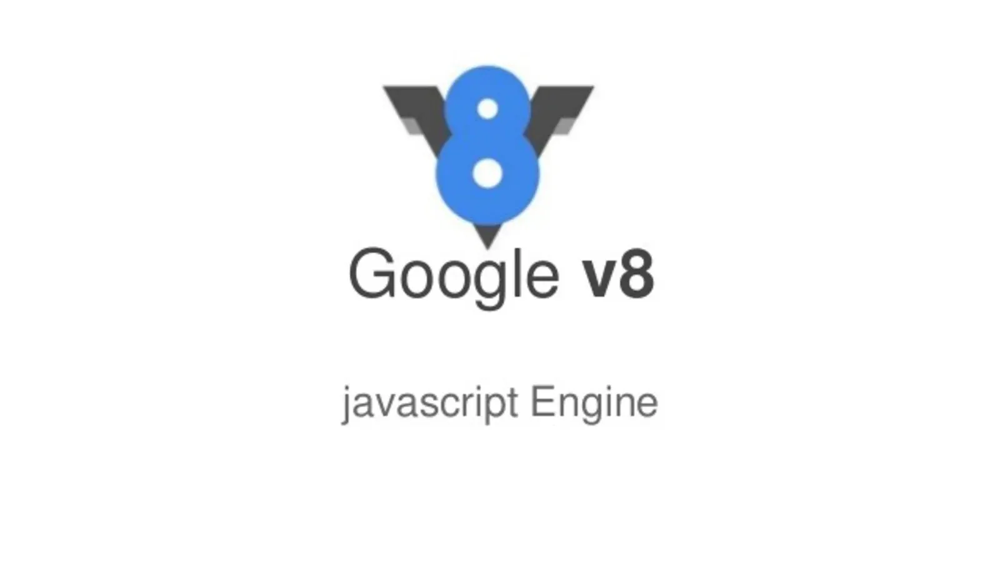
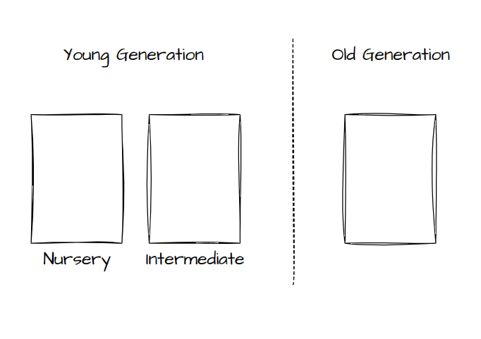

# Node.js 笔记

> 文章最后更新：2023-08-02

## 快速升级依赖

> 下列内容来自 ChatGPT 3.5

要快速升级已有的 `package.json` 文件中的依赖版本，可以按照以下步骤进行操作：

1. 打开你的项目文件夹，在命令行终端中导航到该文件夹的路径。
2. 运行 `npm outdated` 命令，它将显示项目中过时的依赖项及其当前版本和最新版本。这将帮助你确定需要升级的依赖项。
3. 根据 `npm outdated` 的输出，确定你想要升级的依赖项。你可以选择升级所有过时的依赖项，或者只升级你感兴趣的特定依赖项。
4. 运行 `npm update <package-name>` 命令来升级特定的依赖项。将 `<package-name>`
   替换为你要升级的依赖项的名称。如果你要升级多个依赖项，可以在命令中列出它们的名称，用空格分隔。
   例如：`npm update package1 package2 package3`
5. 运行 `npm install` 命令来安装更新后的依赖项。这将根据 `package.json` 文件中的新版本信息来安装依赖项。
6. 检查项目是否正常工作。有时，升级依赖项可能会导致项目出现问题。确保在升级后运行项目并进行测试，以确保一切正常。

请注意，升级依赖项可能会引入不兼容的更改，因此在升级之前最好先备份你的项目文件。此外，如果你的项目使用了锁定版本的机制（例如
`package-lock.json` 或 `yarn.lock`），请确保在升级依赖项之前更新这些锁定文件，以便正确解析依赖项的版本。

# GC 引擎

Chromium 和 Node.js 的 V8 引擎中的 GC (Garbage Collector) 引擎。

## 分代结构

在 V8 中，堆空间会被分成两块区域，或者叫代(generation)，分别叫做新生代(young generation)和老年代(old generation)
，而新生代由分为托儿所(nursery)和中间代(intermediate)。

## GC 流程

### Minor GC (Scavenger)

Minor GC 主要针对新生代进行垃圾回收。在这个过程中，主要有三个步骤：移动对象、清空托儿所和角色互换。

#### 移动对象

在 Minor GC 过程中，V8 会检查新生代中的对象，将存活的对象移动到中间代或老年代。这样可以确保新生代中的空间得到充分利用，同时减少内存碎片。

如果对象是第一次被移动，会移动到中间带，并打上标记，在下一次移动时，被标记的对象会被直接移动到老年代。

#### 清空托儿所

在移动存活对象之后，V8 会清空托儿所，将其内存空间归还给操作系统。这样一来，新生代中的空间就可以重新分配给新创建的对象。

#### 角色互换

清空托儿所后，中间代和托儿所的角色会发生互换，原先的中间代会变成托儿所，托儿所会变成中间代。

### Major GC (Mark Sweep & Mark Compack)

Major GC 主要针对老年代进行垃圾回收。这个过程主要包括三个步骤：GC ROOT、并发标记和并发清除与整理。

#### GC ROOT

在 Major GC 开始时，V8 会首先确定一组根对象（GC ROOT），这些对象是不会被垃圾回收的。通过遍历这些根对象，V8 可以找出所有与之相关的存活对象。

#### 并发标记

在这个阶段，V8 会并行地遍历整个堆空间，标记出所有存活的对象。这个过程可以在 JavaScript 执行过程中并发进行，从而降低垃圾回收对应用程序性能的影响。

#### 并发清除和整理

最后，V8 会清除那些没有被标记为存活的对象，并整理堆空间。这样可以确保内存空间得到充分利用，同时减少内存碎片。
