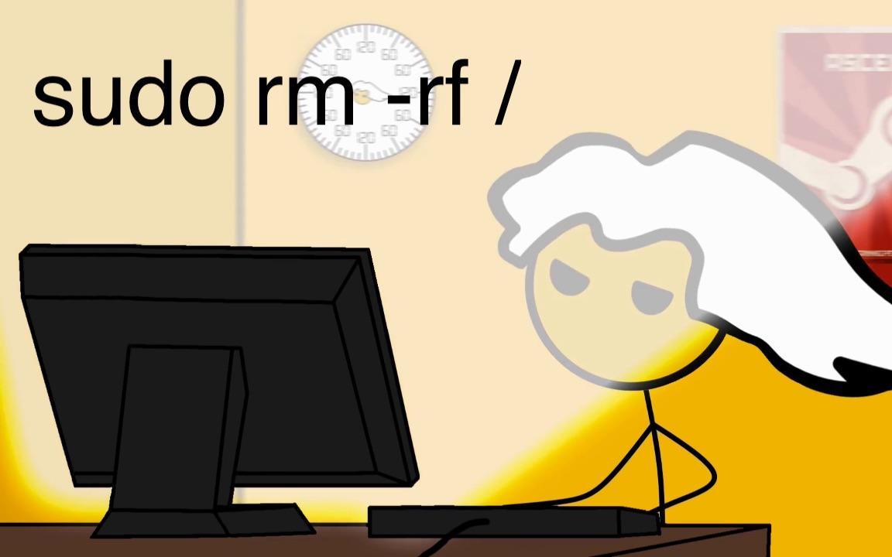

# 系统运维和操作笔记

> 文章最后更新：2024-11-21



## vim 配置文件

```vim
set nocompatible
syntax on
set showmode
set showcmd
set mouse=a
set encoding=utf-8
set t_Co=256
filetype indent on
set autoindent
set expandtab
set tabstop=4
set shiftwidth=4
set softtabstop=4
set smartindent
filetype plugin indent on

set number
"set relativenumber
"set cursorline
set nowrap
"set textwidth=80
"set wrap
"set linebreak
"set wrapmargin=2
set scrolloff=3
set sidescrolloff=10
set laststatus=2
set ruler

set showmatch
set hlsearch
set incsearch
set ignorecase
set smartcase

set undofile
set undodir=~/.vim/.undo//

set autochdir
set noerrorbells
"set visualbell
set belloff=all
set history=1000
set autoread
set listchars=tab:»\ ,trail:·
set list
set wildmenu
set wildmode=longest:list,full
```

## Dockerfile 示例

### Spring Boot 应用

```dockerfile
LABEL maintainer="Demo Docker Image"

# 构建用镜像
FROM maven:3.8.6-eclipse-temurin-17-alpine AS build

# 指定构建过程中的工作目录
WORKDIR /build

# 将src目录下所有文件，拷贝到工作目录中src目录下
COPY src /build/src

# 拷贝配置文件
COPY pom.xml /build

# 执行代码编译命令
RUN mvn mvn -f /build/pom.xml clean package -Dmaven.test.skip=true

# 运行时镜像
FROM eclipse-temurin:17-jre AS RUN

# 指定运行时的工作目录
WORKDIR /app
# 设置数据卷
VOLUME /app/data

# 将构建产物jar包拷贝到运行时目录中
COPY --from=build /build/target/*.jar ./springboot.jar

# 暴露端口
EXPOSE 8080

# 执行启动命令
CMD ["java","-Xms512M", "-Xmx512M", "-jar", "/app/springboot.jar"]
```

## Caddy 常用配置文件

[官方文档](https://caddyserver.com/docs/)

[HSTS 参考](https://developer.mozilla.org/zh-CN/docs/Web/HTTP/Headers/Strict-Transport-Security)

```caddyfile
{
        # 关闭管理面板
        admin off
}

# 通用配置块
(COMMON_CONFIG) {
        # tls 配置
        #tls /etc/caddy/flapypan.cn.pem /etc/caddy/flapypan.cn.key
        # 压缩支持 (br 需要额外插件)
        encode zstd br gzip
        # HSTS 推荐的时间是 2 年
        header Strict-Transport-Security "max-age=63072000; includeSubDomains"
        # 去除响应头
        header -Server
        header -Via
        header -Server
        header -x-powered-by
        # 禁止部分爬虫的ua
        @norobots {
                header_regexp User-Agent "^(|360Spider|JikeSpider|Spider|spider|bot|Bot|2345Explorer|curl|wget|webZIP|qihoobot|Baiduspider|Googlebot(-Mobile|-Image)?|Mediapartners-Google|Adsbot-Google|Feedfetcher-Google|Yahoo! Slurp( China)?|YoudaoBot|Sosospider|Sogou( spider| web spider)|MSNBot|ia_archiver|Tomato Bot|NSPlayer|bingbot)?$"
        }
        redir @norobots http://localhost/ permanent includeSubDomains"
}

# 站点配置

example.org {
        # 重定向到www
        redir https://www.example.org{uri}
        import COMMON_CONFIG
}

blog.example.org {
        # 重定向到www
        redir https://www.example.org{uri}
        import COMMON_CONFIG
}

www.example.org {
        root * /home/user/blog/dist
        route {
                # handle_path 去除前缀，handle 保留
                handle_path /api/* {
                        # 反向代理
                        reverse_proxy localhost:8080
                }
                # 单页面应用
                try_files {path}.html {path} /
                file_server
        }
        import COMMON_CONFIG
}
```

## FFmpeg 常用指令

### 基础用法

```bash
ffmpeg [全局参数] [输入文件参数] -i [输入文件] [输出文件参数] [输出文件]
```

### 完整示例

```bash
ffmpeg -y \
  # 使用qsv硬件解码
  -hwaccel qsv -hwaccel_output_format qsv -init_hw_device qsv=hw \
  -i [input] \
  # 音频编码器
  # libx264 h264_nvenc h264_qsv libx265 hevc_qsv libvpx-vp9 vp9_qsv libaom-av1
  -c:a copy \
  # 视频编码器
  -c:v copy \
  # 质量
  -preset slow\
  # 码率
  -minrate 964K -maxrate 3856K -bufsize 2000K \
  # 720p
  -vf scale=720:-1 \
  # 去除流
  -an -vn \
  [output]
```

### 查看支持的编码器

```bash
ffmpeg -encoders
```

### 查看支持的容器格式(后缀名)

```bash
ffmpeg -formats
```

### 快速转换格式

```bash
# 转换 png 为 webp
ffmpeg -y -i input.png output.webp
# 转换 avi 为 mp4
ffmpeg -y -i input.avi output.mp4
```

### 多个输入合并

```bash
ffmpeg -y -i input.aac -i input.mp4 output.mp4
```

### 截图(从 1:24 开始，每秒一张)

```bash
ffmpeg -y -i input.mp4 -ss 00:01:24 -t 00:00:01 output\_%3d.jpg
```

### 截图(某一帧)

```bash
ffmpeg -ss 01:23:45 -i input.mp4 -vframes 1 \
  # 质量(1-5，1最高质量)
  -q:v 2 \
  output.jpg
```

### 裁剪

```bash
ffmpeg -ss [开始时间] -i [input] -t [持续时间] -c copy [output]
ffmpeg -ss [开始时间] -i [input] -to [结束时间] -c copy [output]
```

### 音频添加图片输出视频

```bash
ffmpeg \
  -loop 1 \
  -i cover.jpg -i input.mp3 \
  -c:v libx264 -c:a aac -b:a 192k -shortest \
  output.mp4
```

## logback 配置文件大全

```xml
<?xml version="1.0" encoding="UTF-8"?>
<!-- 日志级别从低到高分为TRACE < DEBUG < INFO < WARN < ERROR < FATAL，如果设置为WARN，则低于WARN的信息都不会输出 -->
<!-- scan:当此属性设置为true时，配置文档如果发生改变，将会被重新加载，默认值为true -->
<!-- scanPeriod:设置监测配置文档是否有修改的时间间隔，如果没有给出时间单位，默认单位是毫秒。 当scan为true时，此属性生效。默认的时间间隔为1分钟。 -->
<!-- debug:当此属性设置为true时，将打印出logback内部日志信息，实时查看logback运行状态。默认值为false。 -->
<configuration scan="true" scanPeriod="10 seconds">
    <contextName>logback</contextName>

    <!-- 文件切割大小 -->
    <property name="maxFileSize" value="500MB"/>
    <!-- 文档保留天数 -->
    <property name="maxHistory" value="20"/>
    <!-- 文档保留总大小 -->
    <property name="totalSizeCap" value="50GB"/>

    <!-- name的值是变量的名称，value的值时变量定义的值。通过定义的值会被插入到logger上下文中。定义后，可以使“${}”来使用变量。 -->
    <property name="log.path" value="logs"/>

    <!--0. 日志格式和颜色渲染 -->
    <!-- 彩色日志依赖的渲染类 -->
    <conversionRule conversionWord="clr" converterClass="org.springframework.boot.logging.logback.ColorConverter"/>
    <conversionRule conversionWord="wex"
                    converterClass="org.springframework.boot.logging.logback.WhitespaceThrowableProxyConverter"/>
    <conversionRule conversionWord="wEx"
                    converterClass="org.springframework.boot.logging.logback.ExtendedWhitespaceThrowableProxyConverter"/>
    <!-- 彩色日志格式 -->
    <property name="CONSOLE_LOG_PATTERN"
              value="${CONSOLE_LOG_PATTERN:-%clr(%d{yyyy-MM-dd HH:mm:ss.SSS}){faint} %clr(${LOG_LEVEL_PATTERN:-%5p}) %clr(${PID:- }){magenta} %clr(---){faint} %clr([%15.15t]){faint} %clr(%-40.40logger{39}){cyan} %clr(:){faint} %m%n${LOG_EXCEPTION_CONVERSION_WORD:-%wEx}}"/>

    <!--1. 输出到控制台-->
    <appender name="CONSOLE" class="ch.qos.logback.core.ConsoleAppender">
        <!--此日志appender是为开发使用，只配置最底级别，控制台输出的日志级别是大于或等于此级别的日志信息-->
        <filter class="ch.qos.logback.classic.filter.ThresholdFilter">
            <level>debug</level>
        </filter>
        <encoder>
            <Pattern>${CONSOLE_LOG_PATTERN}</Pattern>
            <!-- 设置字符集 -->
            <charset>UTF-8</charset>
        </encoder>
    </appender>

    <!--2. 输出到文档-->
    <!-- 2.1 level为 DEBUG 日志，时间滚动输出  -->
    <appender name="DEBUG_FILE" class="ch.qos.logback.core.rolling.RollingFileAppender">
        <!-- 正在记录的日志文档的路径及文档名 -->
        <file>${log.path}/debug.log</file>
        <!--日志文档输出格式-->
        <encoder class="ch.qos.logback.classic.encoder.PatternLayoutEncoder">
            <pattern>%d{yyyy-MM-dd HH:mm:ss.SSS} [%thread] %-5level %logger{50} - %msg%n</pattern>
            <charset>UTF-8</charset> <!-- 设置字符集 -->
        </encoder>
        <!-- 日志记录器的滚动策略，按日期，按大小记录 -->
        <rollingPolicy class="ch.qos.logback.core.rolling.SizeAndTimeBasedRollingPolicy">
            <!-- 日志归档 -->
            <fileNamePattern>${log.path}/debug-%d{yyyy-MM-dd}.%i.log</fileNamePattern>
            <maxFileSize>100MB</maxFileSize>
            <maxHistory>60</maxHistory>
            <totalSizeCap>20GB</totalSizeCap>
        </rollingPolicy>
        <!-- 此日志文档只记录debug级别的 -->
        <filter class="ch.qos.logback.classic.filter.LevelFilter">
            <level>debug</level>
            <onMatch>ACCEPT</onMatch>
            <onMismatch>DENY</onMismatch>
        </filter>
    </appender>

    <!-- 2.2 level为 INFO 日志，时间滚动输出  -->
    <appender name="INFO_FILE" class="ch.qos.logback.core.rolling.RollingFileAppender">
        <!-- 正在记录的日志文档的路径及文档名 -->
        <file>${log.path}/info.log</file>
        <!--日志文档输出格式-->
        <encoder class="ch.qos.logback.classic.encoder.PatternLayoutEncoder">
            <pattern>%d{yyyy-MM-dd HH:mm:ss.SSS} [%thread] %-5level %logger{50} - %msg%n</pattern>
            <charset>UTF-8</charset>
        </encoder>
        <!-- 日志记录器的滚动策略，按日期，按大小记录 -->
        <rollingPolicy class="ch.qos.logback.core.rolling.SizeAndTimeBasedRollingPolicy">
            <!-- 日志归档 -->
            <fileNamePattern>${log.path}/info-%d{yyyy-MM-dd}.%i.log</fileNamePattern>
            <maxFileSize>100MB</maxFileSize>
            <maxHistory>60</maxHistory>
            <totalSizeCap>20GB</totalSizeCap>
        </rollingPolicy>
        <!-- 此日志文档只记录info级别的 -->
        <filter class="ch.qos.logback.classic.filter.LevelFilter">
            <level>info</level>
            <onMatch>ACCEPT</onMatch>
            <onMismatch>DENY</onMismatch>
        </filter>
    </appender>

    <!-- 2.3 level为 WARN 日志，时间滚动输出  -->
    <appender name="WARN_FILE" class="ch.qos.logback.core.rolling.RollingFileAppender">
        <!-- 正在记录的日志文档的路径及文档名 -->
        <file>${log.path}/warn.log</file>
        <!--日志文档输出格式-->
        <encoder class="ch.qos.logback.classic.encoder.PatternLayoutEncoder">
            <pattern>%d{yyyy-MM-dd HH:mm:ss.SSS} [%thread] %-5level %logger{50} - %msg%n</pattern>
            <charset>UTF-8</charset> <!-- 此处设置字符集 -->
        </encoder>
        <!-- 日志记录器的滚动策略，按日期，按大小记录 -->
        <rollingPolicy class="ch.qos.logback.core.rolling.SizeAndTimeBasedRollingPolicy">
            <!-- 日志归档 -->
            <fileNamePattern>${log.path}/warn-%d{yyyy-MM-dd}.%i.log</fileNamePattern>
            <maxFileSize>100MB</maxFileSize>
            <maxHistory>60</maxHistory>
            <totalSizeCap>20GB</totalSizeCap>
        </rollingPolicy>
        <!-- 此日志文档只记录warn级别的 -->
        <filter class="ch.qos.logback.classic.filter.LevelFilter">
            <level>warn</level>
            <onMatch>ACCEPT</onMatch>
            <onMismatch>DENY</onMismatch>
        </filter>
    </appender>

    <!-- 2.4 level为 ERROR 日志，时间滚动输出  -->
    <appender name="ERROR_FILE" class="ch.qos.logback.core.rolling.RollingFileAppender">
        <!-- 正在记录的日志文档的路径及文档名 -->
        <file>${log.path}/error.log</file>
        <!--日志文档输出格式-->
        <encoder class="ch.qos.logback.classic.encoder.PatternLayoutEncoder">
            <pattern>%d{yyyy-MM-dd HH:mm:ss.SSS} [%thread] %-5level %logger{50} - %msg%n</pattern>
            <charset>UTF-8</charset> <!-- 此处设置字符集 -->
        </encoder>
        <!-- 日志记录器的滚动策略，按日期，按大小记录 -->
        <rollingPolicy class="ch.qos.logback.core.rolling.SizeAndTimeBasedRollingPolicy">
            <!-- 日志归档 -->
            <fileNamePattern>${log.path}/error-%d{yyyy-MM-dd}.%i.log</fileNamePattern>
            <maxFileSize>100MB</maxFileSize>
            <maxHistory>60</maxHistory>
            <totalSizeCap>20GB</totalSizeCap>
        </rollingPolicy>
        <!-- 此日志文档只记录ERROR级别的 -->
        <filter class="ch.qos.logback.classic.filter.LevelFilter">
            <level>ERROR</level>
            <onMatch>ACCEPT</onMatch>
            <onMismatch>DENY</onMismatch>
        </filter>
    </appender>

    <!--
        <logger>用来设置某一个包或者具体的某一个类的日志打印级别、以及指定<appender>。<logger>仅有一个name属性， 一个可选的level和一个可选的addtivity属性。
        name:用来指定受此logger约束的某一个包或者具体的某一个类。
        level:用来设置打印级别，大小写无关：TRACE, DEBUG, INFO, WARN, ERROR, ALL 和 OFF，
              还有一个特俗值INHERITED或者同义词NULL，代表强制执行上级的级别。
              如果未设置此属性，那么当前logger将会继承上级的级别。
        addtivity:是否向上级logger传递打印信息。默认是true。

        <logger name="org.springframework.web" level="info"/>
        <logger name="org.springframework.scheduling.annotation.ScheduledAnnotationBeanPostProcessor" level="INFO"/>
    -->
    <!--减少SpringBoot自动配置的日志信息-->
    <logger name="org.springframework.boot.autoconfigure" level="WARN"/>
    <!--打印SQL日志信息-->
    <logger name="org.mybatis.spring" level="DEBUG"/>
    <!--<logger name="DAO" level="DEBUG"/>-->

    <!--
        root节点是必选节点，用来指定最基础的日志输出级别，只有一个level属性
        level:用来设置打印级别，大小写无关：TRACE, DEBUG, INFO, WARN, ERROR, ALL 和 OFF，不能设置为INHERITED或者同义词NULL。默认是DEBUG
        ，标识这个appender将会添加到这个logger。
    -->

    <root level="info">
        <appender-ref ref="CONSOLE"/>
        <!--        <appender-ref ref="DEBUG_FILE"/>-->
        <!--    <appender-ref ref="INFO_FILE" />-->
        <appender-ref ref="WARN_FILE"/>
        <!--    <appender-ref ref="ERROR_FILE" />-->
    </root>

</configuration>

```
