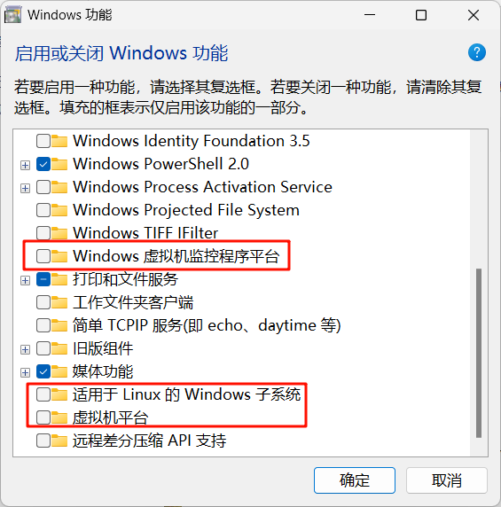
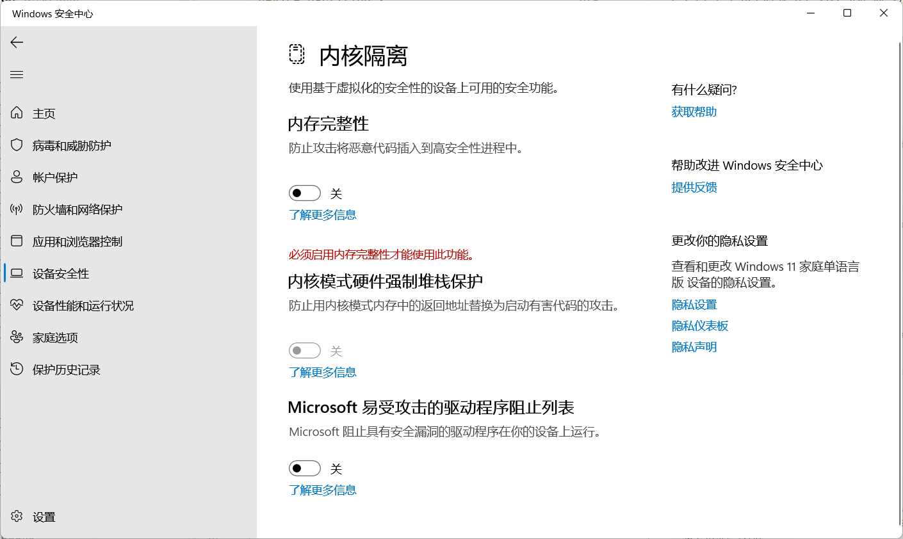

# Windows 使用笔记

> 文章最后更新：2024-07-16


## 删除 win11 中资源管理器左侧的主文件夹和图库

```regedit
Windows Registry Editor Version 5.00

[HKEY_CURRENT_USER\Software\Classes\CLSID\{e88865ea-0e1c-4e20-9aa6-edcd0212c87c}]
"System.IsPinnedToNameSpaceTree"=dword:00000000

[-HKEY_LOCAL_MACHINE\SOFTWARE\Microsoft\Windows\CurrentVersion\Explorer\Desktop\NameSpace\{f874310e-b6b7-47dc-bc84-b9e6b38f5903}]
```

## 解决打开游戏时出现“无法打开此“ms-gamingoverlay"链接”弹窗问题

1. 打开运行（Win+R），并输入 `regedit` 命令，按确定或回车

2. 定位如下位置:

```text
HKEY_CURRENT_USER\SOFTWARE\Microsoft\Windows\CurrentVersion\GameDVR
```

找到`AppCaptureEnabled`这个键值，把值改为 0

3. 定位如下位置：

```text
HKEY_CURRENT_USER\System\GameConfigStore
```

找到 `GameDVR_Enabled` 这个键值，把值改为 0

## 解决 ping localhost 时为 ipv6 地址

### 解决方法

> 请在管理员权限的 cmd 或 powershell 中运行

先查一下前缀优先级：

```powershell
netsh interface ipv6 show prefixpolicies
```

```text
Querying active state...

Precedence  Label  Prefix
----------  -----  --------------------------------
        50      0  ::1/128
        40      1  ::/0
        35      4  ::ffff:0:0/96
        30      2  2002::/16
         5      5  2001::/32
         3     13  fc00::/7
         1     11  fec0::/10
         1     11  3ffe::/16
         1     3   ::/96
```

上面的输出中 `::/0` 是 ipv6 的前缀，需要调低优先级，低于 `::ffff:0:0/96` `::/96` 这些 ipv4 的前缀即可。

依次执行：

```powershell
netsh int ipv6 set prefix ::/96 50 0
netsh int ipv6 set prefix ::ffff:0:0/96 40 1
netsh int ipv6 set prefix 2002::/16 35 2
netsh int ipv6 set prefix 2001::/32 30 3
netsh int ipv6 set prefix ::1/128 10 4
netsh int ipv6 set prefix ::/0 5 5
netsh int ipv6 set prefix fc00::/7 3 13
netsh int ipv6 set prefix fec0::/10 1 11
netsh int ipv6 set prefix 3ffe::/16 1 12
```

再次查询：

```text
Querying active state...

Precedence  Label  Prefix
----------  -----  --------------------------------
        50      0  ::/96
        40      1  ::ffff:0:0/96
        35      2  2002::/16
        30      3  2001::/32
        10      4  ::1/128
         5      5  ::/0
         3     13  fc00::/7
         1     12  3ffe::/16
         1     11  fec0::/10
```

### 前缀含义

> Windows10/11
> 的访问前缀规则参照 [RFC6724: Default Address Selection for Internet Protocol Version 6 (IPv6)](https://www.rfc-editor.org/rfc/rfc6724#section-2.1)
> 实现。
>
>
可参考 [在 IANA IPv6 Special-Purpose Address Registry](https://www.iana.org/assignments/iana-ipv6-special-registry/iana-ipv6-special-registry.xhtml)
查看这些前缀的归属。

## 优化 Windows Defender 性能

### 设置扫描占用的 CPU 比例

查看当前的 CPU 占用比例，默认一般是 50

```powershell
Get-MpPreference | select ScanAvgCPULoadFactor
```

调整 CPU 占用比例，例如设置为 20

```powershell
Set-MpPreference -ScanAvgCPULoadFactor 20
```

### 关闭映射磁盘文件扫描

```powershell
Set-MpPreference -DisableScanningNetworkFiles 1
Set-MpPreference -DisableScanningMappedNetworkDrivesForFullScan 1
```

## 彻底关闭 Hyper-V、WSL、Device Guard、Credential Guard

> 关闭下列基于虚拟化的相关服务和模块以提升性能
>
> **注意：** WSL2、Docker Desktop、Podman Desktop 等基于 Hyper-V 的软件将无法工作
>
> ~~反正我不用这些软件~~

### 关闭 Hyper-V 以及相关服务

首先在终端管理员中关闭 Hyper-V

```powershell
Disable-WindowsOptionalFeature -Online -FeatureName Microsoft-Hyper-V-Hypervisor
bcdedit /set hypervisorlaunchtype off
```

再进入 Windows 功能关闭其他功能



### 关闭内存完整性



### 关闭 Device Guard

进入注册表

```text
HKEY_LOCAL_MACHINE\SYSTEM\CurrentControlSet\Control\DeviceGuard

EnableVirtualizationBasedSecurity = 0
RequirePlatformSecurityFeatures = 0
```

### 关闭 Credential Guard

进入注册表

```text
HKEY_LOCAL_MACHINE\SYSTEM\CurrentControlSet\Control\Lsa

LsaCfgFlags = 0
```

```text
HKEY_LOCAL_MACHINE\SOFTWARE\Policies\Microsoft\Windows\DeviceGuard

LsaCfgFlags = 0
```

进入管理员 CMD

```cmd
bcdedit /set vsmlaunchtype off
mountvol X: /s
copy %WINDIR%\System32\SecConfig.efi X:\EFI\Microsoft\Boot\SecConfig.efi /Y
bcdedit /create {0cb3b571-2f2e-4343-a879-d86a476d7215} /d "DebugTool" /application osloader
bcdedit /set {0cb3b571-2f2e-4343-a879-d86a476d7215} path "\EFI\Microsoft\Boot\SecConfig.efi"
bcdedit /set {bootmgr} bootsequence {0cb3b571-2f2e-4343-a879-d86a476d7215}
bcdedit /set {0cb3b571-2f2e-4343-a879-d86a476d7215} loadoptions DISABLE-LSA-ISO,DISABLE-VBS
bcdedit /set {0cb3b571-2f2e-4343-a879-d86a476d7215} device partition=X:
mountvol X: /d
```

**重启电脑后会提示关闭 Credential Guard，按 `Win + F3` 确认**

> 参考：<https://learn.microsoft.com/zh-cn/windows/security/identity-protection/credential-guard/configure?tabs=reg>

## 安装开启 Hyper-V

```cmd
pushd "%~dp0"
dir /b %SystemRoot%\servicing\Packages\*Hyper-V*.mum >hyper-v.txt
for /f %%i in ('findstr /i . hyper-v.txt 2^>nul') do dism /online /norestart /add-package:"%SystemRoot%\servicing\Packages\%%i"
del hyper-v.txt
Dism /online /enable-feature /featurename:Microsoft-Hyper-V-All /LimitAccess /ALL
```

## 重新编译 .net framework 机器码

```powershell
$env:PATH = [Runtime.InteropServices.RuntimeEnvironment]::GetRuntimeDirectory()
[AppDomain]::CurrentDomain.GetAssemblies() | ForEach-Object {
    $path = $_.Location
    if ($path) {
        $name = Split-Path $path -Leaf
        Write-Host -ForegroundColor Yellow "`r`n$name"
        ngen.exe install $path /nologo
    }
}
```

## 清除图标缓存

```cmd
taskkill /f /im explorer.exe

cd /d %userprofile%\AppData\Local\Microsoft\Windows\Explorer

attrib -h iconcache_*.db

del iconcache_*.db /a

CD /d %userprofile%\AppData\Local

DEL IconCache.db /a

start explorer

start explorer.exe

cho 执行完成
```

## 安装开启组策略

```cmd
@echo off
pushd "%~dp0"
dir /b C:\Windows\servicing\Packages\Microsoft-Windows-GroupPolicy-ClientExtensions-Package~3*.mum >List.txt
dir /b C:\Windows\servicing\Packages\Microsoft-Windows-GroupPolicy-ClientTools-Package~3*.mum >>List.txt
for /f %%i in ('findstr /i . List.txt 2^>nul') do dism /online /norestart /add-package:"C:\Windows\servicing\Packages\%%i"
pause
```

## powershell 配置

```powershell
$Env:POWERSHELL_UPDATECHECK="LTS"

$OutputEncoding = [console]::InputEncoding = [console]::OutputEncoding = New-Object System.Text.UTF8Encoding

Import-Module PSReadLine
Set-PSReadLineOption -Colors @{
    Command                = [ConsoleColor]::Blue
    Comment                = [ConsoleColor]::DarkGray
    ContinuationPrompt     = [ConsoleColor]::White
    Default                = [ConsoleColor]::White
    Emphasis               = [ConsoleColor]::Cyan
    Error                  = [ConsoleColor]::Red
    InlinePrediction       = [ConsoleColor]::DarkGray
    Keyword                = [ConsoleColor]::DarkBlue
    ListPrediction         = [ConsoleColor]::DarkGray
    ListPredictionSelected = "$([char]0x1b)[30;47m"
    Member                 = [ConsoleColor]::Magenta
    Number                 = [ConsoleColor]::Blue
    Operator               = [ConsoleColor]::White
    Parameter              = [ConsoleColor]::White
    String                 = [ConsoleColor]::DarkGreen
    'Type'                 = [ConsoleColor]::Green
    Variable               = [ConsoleColor]::Yellow
}
Set-PSReadLineOption -PredictionSource History
Set-PSReadLineOption -HistorySearchCursorMovesToEnd
Set-PSReadLineKeyHandler -Key "Tab" -Function MenuComplete
Set-PSReadlineKeyHandler -Key "Ctrl+d" -Function ViExit
Set-PSReadLineKeyHandler -Key "Ctrl+z" -Function Undo
Set-PSReadLineKeyHandler -Key UpArrow -Function HistorySearchBackward
Set-PSReadLineKeyHandler -Key DownArrow -Function HistorySearchForward

function ListDirectory {
    (Get-ChildItem).Name
    Write-Host("")
}
Set-Alias -Name ls -Value ListDirectory -Option AllScope
Set-Alias -Name ll -Value Get-ChildItem -Option AllScope

function OpenCurrentFolder {
    param
    (
        $Path = '.'
    )
    Invoke-Item $Path
}
Set-Alias -Name open -Value OpenCurrentFolder -Option AllScope

Set-Alias -Name pn -Value pnpm -Option AllScope

Invoke-Expression (&starship init powershell)

```
