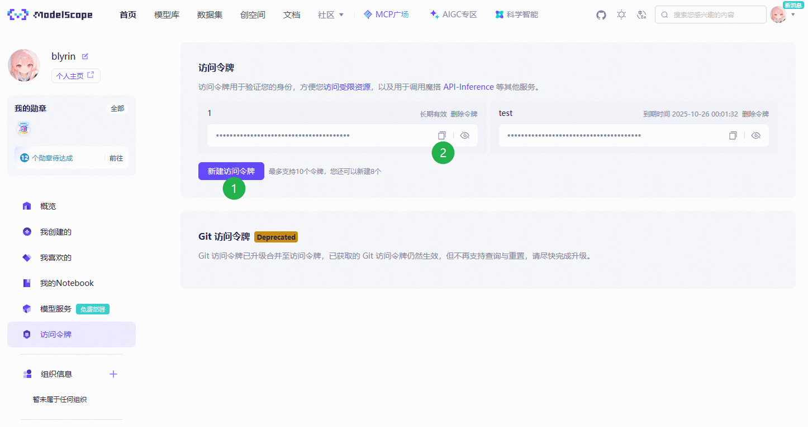

# Claude Code 穷鬼方案


> 文章最后更新日期：2025-11-18

分享下我的一套穷人使用 Claude Code 的方案

## 写在前面

注意这套方案只是把 Claude Code（以下简称 cc）的 api 换成免费的其他模型

~~Claude 模型确实贵啊~~

目前 Claude Code 是业内顶尖的编程 Agent，哪怕换了开源模型也能发挥出非常强的实力

~~说的就是你 trae，模型不差但是配了个稀烂的工具~~

## 先决条件

- 好用的终端软件，Windows 11 推荐直接使用内置的 `终端` 软件
- 科学上网

> Claude 一般指 Anthropics 公司旗下的模型
>
> Claude Code 是 Anthropics 开发的终端编码 Agent

## 安装 Claude Code

> Claude Code 官网：<https://claude.com/product/claude-code>
>
> Claude Code 官方文档：<https://docs.claude.com/en/docs/claude-code/overview>

使用下面指令安装或更新 cc

Windows 在 PowerShell 下执行：

```shell
irm https://claude.ai/install.ps1 | iex
```

Linux、WSL、macOS 在命令行执行：

```shell
curl -fsSL https://claude.ai/install.sh | bash
```

安装好后启动一次看是否正常：

```shell
claude
```

**因为我们没有登录 Anthropics 账号此时还用不了 cc，我们需要在后续步骤替换为自己的 API**

## 安装 Claude Code Router

Claude Code Router（以下简称ccr）是一个帮助我们将 cc 的请求代理到自定义 API 的开源项目

> 开源地址：<https://github.com/musistudio/claude-code-router>

使用下面指令安装或更新 cc：

```shell
npm i -g @musistudio/claude-code-router@latest
```

或使用镜像：

```shell
npm --registry=https://registry.npmmirror.com i -g @musistudio/claude-code-router@latest
```

## 配置 API

配置 ccr 有配置文件和 ui 两种方式，推荐使用 ui 方式比较直观

在命令行中输入：

```shell
ccr ui
```

ccr 会在后台运行，并自动打开浏览器访问 <http://127.0.0.1:3456/ui/> 配置界面

下面是我已经配置好的


### 一些免费的 API

一般情况下，添加一个魔搭社区的 api 就足够使用了

#### 魔搭社区

> 魔搭社区目前每天有每个模型 200 次免费额度，2000 次总额度，不限制 tokens 数量

官网：<https://modelscope.cn/>

注册后在账号设置 <https://modelscope.cn/my/accountsettings> 进行实名认证

在访问令牌 <https://modelscope.cn/my/myaccesstoken> 页面新建一个新的令牌并复制备用



回到 ccr 的 ui 配置页面，点击添加供应商，从模板导入选择 modelscope 并在 API 密钥输入刚才复制的令牌


模型推荐使用 GLM 系列模型，可以在魔搭社区的模型库筛选可以免费使用的模型


进入模型详情页后复制模型 ID 填到 ccr ui 配置的模型列表中


推荐添加的模型 ID：

- ZhipuAI/GLM-4.6（默认）
- Qwen/Qwen3-VL-235B-A22B-Instruct（视觉）
- Qwen/Qwen3-Coder-480B-A35B-Instruct（后台）
- Qwen/Qwen3-235B-A22B-Instruct-2507（后台）

#### 心流开放平台

> 心流开放平台目前每天无限量调用，但并发次数只有 1（同一个账号只能有一个请求在进行，只要不用作后台模型即可）

官网：<https://platform.iflow.cn>

注册后在 API Key 设置 <https://platform.iflow.cn/profile?tab=apiKey> 添加密钥并复制

回到 ccr ui 设置，添加供应商选择模板 iflow

模型 ID 可以在模型库 <https://platform.iflow.cn/models> 直接复制

推荐添加的模型 ID：

- glm-4.6（默认）
- qwen3-vl-plus（视觉）
- qwen3-coder-plus（默认）（长上下文）
- kimi-k2-0905（默认）

#### OpenRouter

官网：<https://openrouter.ai/>

openrouter 注册后可用使用一些免费的模型

密钥管理：<https://openrouter.ai/settings/keys>

免费生文模型列表：<https://openrouter.ai/models?fmt=table&max_price=0&output_modalities=text>

推荐添加的模型 ID：

- google/gemini-2.0-flash-exp:free（网络搜索）
- z-ai/glm-4.5-air:free（后台）
- qwen/qwen3-coder:free（后台）
- openai/gpt-oss-120b:free（后台）

#### 硅基流动

官网：<https://siliconflow.cn/>

硅基流动目前免费的 API 可用的模型都是小参数的，不适合编码，有需要可自行了解

#### 谷歌 AI Studio

官网：<https://aistudio.google.com/>

需要科学上网且限制地区

谷歌有免费的 Gemini 模型，但目前不太稳定经常断流，有需要可自行了解

~~gemini 在 cc 里经常不会调用工具~~

### 推荐的配置

配置说明：

- 默认：默认模型，顾名思义
- 后台：执行后台任务，如搜索文件、执行命令行等轻量任务时使用，推荐使用小参数模型
- 思考：思考场景使用的模型，需要模型支持思考
- 长上下文：对话上下文非常长时会自动切到该模型，推荐使用上下文长的模型
    - 上下文阈值：切换模型的阈值，默认即可
- 网络搜索：使用模型内置联网搜索功能，需要模型支持
- 图像：识别图片的模型，需要模型支持视觉

下列配置是根据我个人使用情况总结出来的（截至文章最后编辑日期），请根据自己项目的实际情况选择

> 不加参数说明默认为最大参数型号，模型信息可在 <https://models.dev/> 查询

> 目前并**不推荐使用 DeepSeek 系列**写代码，~~有点蠢~~

#### 最简配置

- 默认：glm 4.6、qwen3 coder plus、kimi k2 0905
- 后台：glm 4.5 air、qwen3 coder、qwen3、gpt oss 120B

#### 完整配置

- 默认：glm 4.6、qwen3 coder plus、kimi k2 0905
- 后台：glm 4.5 air、qwen3 coder、qwen3、gpt oss 120B
- 思考：glm 4.6
- 长上下文：qwen3 max、glm 4.6、kimi k2 0905、qwen3 coder plus
- 网络搜索：推荐内置网络搜索的 gemini flash、gemini flash lite
- 图像（根据需要）：qwen3 vl (plus)、glm 4.5v

## 如何使用

配置完成后记得保存

```shell
# 进入项目目录
cd <你的项目>
# 使用 ccr 启动 cc
ccr code
```
